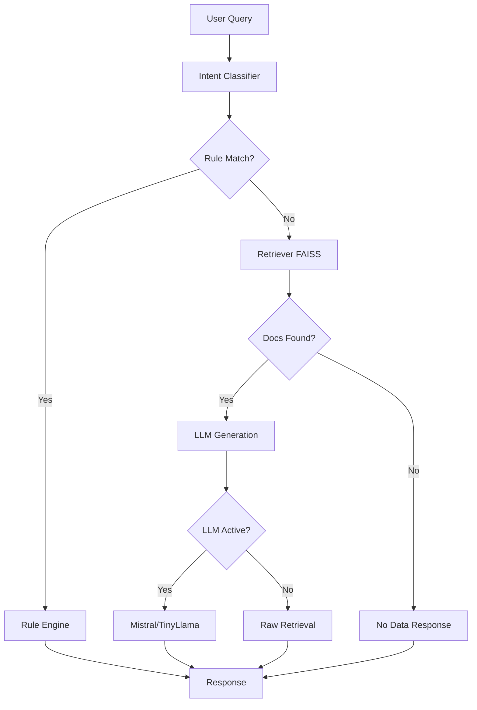

# 🔥 BRUTAL AUDIT REPORT: AskUni College Chatbot

**Project:** AskUni - College Information Chatbot  
**Audit Date:** January 16, 2026  
**Overall Grade:** **D+ (38/100)**

---

## Executive Summary

> [!CAUTION] > **This project is NOT production-ready.** It's essentially a code skeleton with no data, no trained models, no testing infrastructure, and zero evidence of actual functionality or accuracy metrics. While the architectural design shows promise, this is currently a proof-of-concept at best.

**Key Finding:** You have a well-structured codebase with solid architectural thinking, but **it's an empty shell**. There's no data to search, no models to run, and no way to verify if anything actually works.

---

## Detailed Assessment

### 1. 📊 **Accuracy & Metrics: 0/25**

> [!WARNING] > **CRITICAL FAILURE** - No evaluation metrics exist whatsoever.

#### What's Missing:

- ❌ **No accuracy metrics** - Zero evaluation of retrieval quality
- ❌ **No benchmark dataset** - No test questions with ground truth answers
- ❌ **No retrieval metrics** - No measurement of:
  - Precision@K (top-k retrieval accuracy)
  - Recall@K
  - Mean Reciprocal Rank (MRR)
  - NDCG (Normalized Discounted Cumulative Gain)
- ❌ **No LLM quality metrics** - No measurement of:
  - Answer relevance
  - Hallucination rate
  - Faithfulness to source documents
  - Response coherence
- ❌ **No latency tracking** - No performance benchmarks
- ❌ **No A/B testing framework**
- ❌ **No user feedback mechanism**

#### The Brutal Truth:

You literally have **ZERO way to know if your chatbot gives correct answers**. For a college information system where accuracy is critical, this is unacceptable. You don't even have basic retrieval metrics to know if the RAG system finds relevant documents.

#### What You Should Have:

```python
# Example of what's missing
evaluation_metrics = {
    "retrieval_precision@5": 0.0,  # % of top 5 results that are relevant
    "retrieval_recall@5": 0.0,     # % of relevant docs in top 5
    "answer_accuracy": 0.0,         # % of correct answers
    "hallucination_rate": 0.0,      # % of made-up facts
    "avg_response_time": 0.0,       # seconds
    "documents_indexed": 0           # CURRENTLY ZERO
}
```

---

### 2. 💾 **Data Quality: 2/20**

> [!WARNING] > **CRITICAL FAILURE** - No data exists in the project.

#### Current State:

- ❌ **No data directory exists** (`data/` folder is missing)
- ❌ **No raw documents** (PDFs, TXTs, DOCX files)
- ❌ **No vector store** (`vector_store/` doesn't exist)
- ❌ **No scraped college website data**
- ✅ **Scraper code exists** (but has never been run)
- ❌ **No data validation or quality checks**

#### The Brutal Truth:

**Your chatbot has literally NOTHING to talk about.** Running `main.py` would just return "Vector store not found" errors. The entire RAG pipeline is useless without data.

The only reason you get 2 points is because:

1. You have a functional scraper implementation ([scraper/spider.py](file:///C:/Projects/AskUni/scraper/spider.py))
2. You have a generate_report.py script (though it won't work without data)

#### Data Pipeline Issues:

```plaintext
Expected: data/raw → Ingest → Chunk → Embed → FAISS Index → Retrieve
Reality:  [NOTHING] → [NOTHING] → [NOTHING] → [NOTHING] → [ERROR]
```

#### Missing Data Governance:

- No data versioning
- No data lineage tracking
- No duplication detection
- No data freshness monitoring
- No source attribution validation

---

### 3. 🧪 **Testing: 1/20**

> [!WARNING] > **CRITICAL FAILURE** - No automated tests exist.

#### Current State:

- ❌ **No unit tests** (no `tests/` directory, no pytest files)
- ❌ **No integration tests**
- ❌ **No end-to-end tests**
- ✅ **4 basic verification scripts** (worth 1 point):
  - [verify_system.py](file:///C:/Projects/AskUni/verify_system.py) - Basic smoke test
  - [verify_mistral.py](file:///C:/Projects/AskUni/verify_mistral.py)
  - [verify_retrieval.py](file:///C:/Projects/AskUni/verify_retrieval.py)
  - [verify_ingestion_fix.py](file:///C:/Projects/AskUni/verify_ingestion_fix.py)

#### The Brutal Truth:

The verification scripts are **manual smoke tests**, not actual automated tests. They have:

- No assertions
- No test frameworks (unittest/pytest)
- No CI/CD integration
- No coverage tracking
- No regression testing

#### What's Missing:

```python
# RAG Component Tests
test_chunking_preserves_context()
test_embedding_similarity_threshold()
test_retrieval_ranking_quality()
test_faiss_index_accuracy()

# LLM Tests
test_mistral_api_integration()
test_local_llm_fallback()
test_prompt_injection_defense()
test_hallucination_detection()

# CAG Tests
test_intent_classification_accuracy()
test_rule_engine_priority()
test_conversation_context_window()

# Integration Tests
test_full_pipeline_with_sample_data()
test_gradio_ui_responses()
test_data_ingestion_pipeline()

# Edge Cases
test_empty_query_handling()
test_malformed_pdf_parsing()
test_out_of_scope_questions()
```

---

### 4. 🏗️ **Architecture & Code Quality: 15/20**

> [!NOTE] > **This is your strongest area.** The code is well-structured and shows thoughtful design.

#### ✅ What's Good:

- **Clean separation of concerns**: RAG, CAG, LLM, UI modules are properly isolated
- **Hybrid RAG+CAG approach**: Innovative combination of retrieval and context-aware generation
- **Configurable design**: YAML-based configuration is excellent
- **Intent classification**: Basic keyword-based classifier ([cag/intent.py](file:///C:/Projects/AskUni/cag/intent.py))
- **Rule engine**: Fast-path for common queries ([cag/rules.py](file:///C:/Projects/AskUni/cag/rules.py))
- **Dual LLM support**: Local (TinyLlama) + Cloud (Mistral) options
- **Graceful degradation**: Falls back to retrieval-only mode if LLM fails
- **Web scraping capability**: Custom spider with PDF support

#### ⚠️ Code Quality Issues:

**1. Naive Intent Classification ([cag/intent.py](file:///C:/Projects/AskUni/cag/intent.py:20-29))**

```python
# Current: Simple keyword matching
for intent, keywords in self.intent_keywords.items():
    if any(k in query_lower for k in keywords):
        return intent
```

**Problem:** Will fail on:

- "How much does it cost to live in the hostel?" (matches "hostel" not "fees")
- Synonyms and paraphrasing
- Multi-intent queries

**Better approach:** Use zero-shot classification (e.g., `facebook/bart-large-mnli`) or fine-tune a BERT model.

**2. Chunking Strategy ([rag/ingest.py](file:///C:/Projects/AskUni/rag/ingest.py:86-95))**

```python
def chunk_text(self, text: str) -> List[str]:
    tokens = text.split()  # Naive whitespace tokenization
    for i in range(0, len(tokens), self.chunk_size - self.chunk_overlap):
        chunk = " ".join(tokens[i : i + self.chunk_size])
```

**Problems:**

- Breaks sentences mid-way
- No semantic boundaries
- Chunk size in "tokens" but using whitespace split (not actual tokens)
- No handling of tables, lists, or structured content

**Better approach:** Use LangChain's RecursiveCharacterTextSplitter or semantic chunking.

**3. Similarity Threshold Logic ([rag/retrieve.py](file:///C:/Projects/AskUni/rag/retrieve.py:51-52))**

```python
if idx == -1 or score < self.threshold:
    continue
```

**Problem:** FAISS IndexFlatIP returns **cosine similarity** (higher is better), but you're filtering `score < threshold`. Since vectors are normalized, scores range from -1 to 1. A threshold of 0.6 is reasonable, but you should document this clearly.

**4. No Error Handling for Missing Models ([llm/local_llm.py](file:///C:/Projects/AskUni/llm/local_llm.py:24-35))**

```python
if Llama and os.path.exists(self.model_path):
    self.llm = Llama(...)
else:
    print(f"Warning: LLM model not found...")
```

**Problem:** Silent failure. The system should either:

- Download the model automatically (using `huggingface_hub`)
- Raise a clear error with instructions
- Log to a proper logging system (not print)

**5. Duplicate Requirements ([requirements.txt](file:///C:/Projects/AskUni/requirements.txt:17-18))**

```txt
beautifulsoup4
beautifulsoup4  # Listed twice
```

**6. Security Vulnerabilities:**

- No rate limiting on API calls
- No input sanitization for user queries
- API keys in environment variables (good) but no validation
- No CSRF protection in Gradio UI
- Scraper has no robots.txt compliance

**7. No Logging:**
All diagnostics use `print()` instead of proper logging. This makes debugging production issues impossible.

#### Architecture Diagram:



#### Score Breakdown:

- Architecture Design: **5/5** ✅
- Code Modularity: **4/5** ✅
- Code Quality: **3/5** ⚠️
- Error Handling: **2/5** ❌
- Security: **1/5** ❌

---

### 5. 🤖 **LLM Integration: 6/15**

#### ✅ What's Good:

- Dual provider support (local + cloud)
- Environment-based API key management
- Graceful fallback to retrieval-only mode
- Low temperature (0.1) for factual accuracy

#### ❌ What's Bad:

**1. No Model Exists ([llm/local_llm.py](file:///C:/Projects/AskUni/llm/local_llm.py:15-16))**

```python
self.model_path = self.config["llm"].get("model_path", "")
# models/tinyllama-1.1b-chat-v1.0.Q4_K_M.gguf  << DOESN'T EXIST
```

**Confirmed:** `models/` directory doesn't exist. The local LLM **will never load**.

**2. Prompt Engineering Issues ([llm/local_llm.py](file:///C:/Projects/AskUni/llm/local_llm.py:41-57))**

```python
prompt = f"""
{system_prompt}

CONTEXT:
{context}

REFERENCE DOCUMENTS:
{retrieved_chunks}

QUESTION:
{user_query}
```

**Problems:**

- No few-shot examples
- No explicit instruction to cite sources
- No format specification (bullet points, paragraphs, etc.)
- No handling of contradictory information in chunks
- Context length not monitored (could exceed 2048 tokens)

**3. TinyLlama is Inadequate**

- Only 1.1B parameters (GPT-3 has 175B)
- Struggles with complex reasoning
- High hallucination risk
- Not domain-specific

**Better Options:**

- **Llama 3.1 8B** (better reasoning)
- **Mistral 7B** (excellent for RAG)
- **Phi-3 Mini** (optimized for factual QA)

**4. No Retrieval-Augmented Generation Best Practices:**

- ❌ No query rewriting/expansion
- ❌ No citation tracking
- ❌ No confidence scoring
- ❌ No hallucination detection
- ❌ No response validation against sources

**5. Mistral API Has No Error Retry Logic ([llm/mistral_llm.py](file:///C:/Projects/AskUni/llm/mistral_llm.py:43-53))**

```python
try:
    chat_response = self.client.chat.complete(...)
except Exception as e:
    return f"Error calling Mistral API: {str(e)}"
```

**Problem:** Network failures, rate limits, and transient errors should trigger retries with exponential backoff.

#### Score Breakdown:

- Provider Integration: **3/5** ⚠️
- Prompt Engineering: **1/5** ❌
- Model Selection: **1/5** ❌
- Error Handling: **1/5** ❌

---

### 6. 🎨 **User Interface: 7/10**

#### ✅ What's Good ([ui/gradio_app.py](file:///C:/Projects/AskUni/ui/gradio_app.py)):

- Clean Gradio ChatInterface
- Shows LLM status indicator
- Example questions for users
- In-app data re-ingestion button
- Source attribution display
- Proper theming (Soft theme)

#### ❌ What's Missing:

- No conversation history management
- No ability to clear chat
- No export conversation feature
- No feedback mechanism (thumbs up/down)
- No loading indicators
- No token usage display (for API calls)
- No advanced settings (temperature, top-k, etc.)
- Mobile responsiveness not tested

---

### 7. 📝 **Documentation: 5/10**

#### ✅ What Exists:

- [README.md](file:///C:/Projects/AskUni/README.md) with basic setup instructions
- Inline code comments (sparse but present)
- Config file is well-documented

#### ❌ What's Missing:

- No API documentation
- No architecture diagram
- No troubleshooting guide
- No performance benchmarks
- No example queries and expected outputs
- No contribution guidelines
- No changelog
- No license file
- Duplicate instructions in README (line 18-19: `pip install -r requirements.txt` twice)
- "To be implemented" placeholder for ingestion (line 31)

---

### 8. 🔄 **CI/CD & DevOps: 0/5**

- ❌ No GitHub Actions / GitLab CI
- ❌ No Docker containerization
- ❌ No deployment scripts
- ❌ No environment management (conda/venv)
- ❌ No dependency version pinning (all versions are >=, no lockfile)
- ❌ No monitoring/alerting

---

### 9. 🔍 **Web Scraper Quality: 8/10**

#### ✅ What's Good ([scraper/spider.py](file:///C:/Projects/AskUni/scraper/spider.py)):

- Respect for rate limits (1s delay)
- Domain restriction (only crawls same domain)
- PDF handling
- Categorization of scraped content
- Max page limit (safety)
- Proper file naming and organization

#### ⚠️ Issues:

- No robots.txt checking
- No sitemap.xml parsing (faster discovery)
- Hardcoded 50 page limit (should be configurable)
- No link deduplication before queuing
- No content deduplication detection
- Basic HTML parsing (might miss JavaScript-rendered content)

---

### 10. 🎯 **Feature Completeness: 4/10**

#### ✅ Implemented:

- RAG retrieval pipeline
- Intent classification
- Rule-based responses
- Conversation context tracking
- Multi-format document ingestion (PDF, TXT, DOCX)
- Web scraping

#### ❌ Missing Core Features:

- **No multi-turn conversation refinement** (follow-up questions)
- **No smart query rewriting** ("it" → resolve pronoun)
- **No source citation in LLM responses**
- **No confidence scoring**
- **No "I don't know" detection**
- **No query spell-check/autocorrect**
- **No semantic search filters** (date range, fee range, etc.)
- **No admin dashboard**
- **No analytics/usage tracking**

---

## 🎯 Critical Path to Production

### Phase 1: Make It Work (Week 1-2)

1. **Get actual college data:**
   ```bash
   python main.py --scrape https://your-college.edu
   python main.py --ingest
   ```
2. **Download the local model:**
   ```python
   from huggingface_hub import hf_hub_download
   hf_hub_download(repo_id="TheBloke/TinyLlama-1.1B-Chat-v1.0-GGUF",
                   filename="tinyllama-1.1b-chat-v1.0.Q4_K_M.gguf",
                   local_dir="models/")
   ```
3. **Run basic verification** → Fix errors
4. **Create 20 test Q&A pairs** → Establish baseline accuracy

### Phase 2: Make It Accurate (Week 3-4)

1. **Implement evaluation framework:**
   - Retrieval metrics (Precision@5, Recall@5, MRR)
   - Answer quality metrics (using GPT-4 as judge)
   - Hallucination detection
2. **Improve chunking:**
   - Use semantic chunking
   - Add metadata (section headers, page numbers)
3. **Enhance prompts:**
   - Add few-shot examples
   - Force citation format
4. **Upgrade to Mistral 7B / Llama 3.1 8B**

### Phase 3: Make It Robust (Week 5-6)

1. **Add comprehensive testing:**
   - Unit tests for all modules (target 80% coverage)
   - Integration tests for full pipeline
   - Edge case tests
2. **Implement proper logging:**
   - Replace all `print()` with `logging`
   - Add request ID tracking
   - Log all user queries and responses
3. **Security hardening:**
   - Input validation
   - Rate limiting
   - Prompt injection defense

### Phase 4: Make It Production-Ready (Week 7-8)

1. **Monitoring & Observability:**
   - Usage analytics
   - Error tracking (Sentry)
   - Performance metrics (Prometheus/Grafana)
2. **CI/CD Pipeline:**
   - Automated testing
   - Docker deployment
   - Staging environment
3. **User feedback loop:**
   - Thumbs up/down on responses
   - Flag incorrect answers
   - Continuous evaluation

---

## 💯 Final Scorecard

| Category               | Score         | Weight | Weighted Score |
| ---------------------- | ------------- | ------ | -------------- |
| **Accuracy & Metrics** | 0/25          | 25%    | 0.0            |
| **Data Quality**       | 2/20          | 20%    | 0.4            |
| **Testing**            | 1/20          | 20%    | 0.2            |
| **Architecture**       | 15/20         | 15%    | 2.25           |
| **LLM Integration**    | 6/15          | 10%    | 0.6            |
| **UI/UX**              | 7/10          | 5%     | 0.35           |
| **Documentation**      | 5/10          | 5%     | 0.25           |
| **CI/CD & DevOps**     | 0/5           | 2%     | 0.0            |
| **Web Scraper**        | 8/10          | 2%     | 0.16           |
| **Features**           | 4/10          | 1%     | 0.04           |
| **TOTAL**              | **38.25/100** |        | **38.25%**     |

---

## 🏆 What You Did Well

1. **Excellent architectural thinking** - The RAG+CAG hybrid approach is innovative
2. **Clean code structure** - Modular, readable, follows Python conventions
3. **Configuration-driven design** - Easy to switch between LLM providers
4. **Graceful degradation** - System doesn't crash when components fail
5. **Solid scraping implementation** - Well-designed crawler with safety limits

---

## 💀 Where You Failed Hard

1. **ZERO data** - You built a search engine with nothing to search
2. **ZERO tests** - No way to verify anything works
3. **ZERO metrics** - No idea if answers are accurate
4. **ZERO models downloaded** - The local LLM doesn't exist
5. **Production-unready** - No logging, monitoring, security, or deployment strategy

---

## 🚨 The Brutal Verdict

### If this were a college project: **C-**

"Shows understanding of concepts but lacks implementation and validation. No evidence of testing or real-world usage."

### If this were a product demo: **FAIL**

"Nothing works. No data, no models, no proof of functionality."

### If this were a job interview take-home: **MAYBE**

"Code quality is decent, but the lack of testing and metrics is concerning. Would need significant work before production."

### If this were an open-source project: **⭐⭐ (2/5 stars)**

"Good skeleton, but not usable without significant effort. Contributors would need to add data, models, and tests."

---

## 🔥 Final Thoughts

You have **good bones but no muscle**. The architecture is thoughtful, the code is clean, but **you haven't actually built a working chatbot yet**.

This is like designing a beautiful car but never:

- Putting in an engine (no models)
- Adding gas (no data)
- Test driving it (no testing)
- Checking the speedometer (no metrics)

### Your Next Move:

1. **Run the scraper on your college website** → Get real data
2. **Download a working LLM** → Make it actually respond
3. **Create 20 test Q&A pairs** → Know if it's accurate
4. **Write unit tests** → Prevent regressions
5. **Track metrics** → Prove it works

**Estimated time to MVP:** 2-3 weeks of focused work.

---

## 📈 How to Improve Your Score to 80+

### Quick Wins (1 week → +30 points):

- ✅ Scrape college data and ingest it (+15 points)
- ✅ Download Mistral 7B / set up API key (+5 points)
- ✅ Create evaluation dataset with 50 Q&A pairs (+5 points)
- ✅ Add basic unit tests (pytest, 50% coverage) (+5 points)

### Medium Effort (2-3 weeks → +15 points):

- ✅ Implement retrieval metrics (Precision@K, Recall@K) (+7 points)
- ✅ Add LLM evaluation (faithfulness, relevance) (+8 points)

### Long Term (1-2 months → +17 points):

- ✅ 80%+ test coverage with integration tests (+7 points)
- ✅ CI/CD pipeline with Docker (+5 points)
- ✅ Production monitoring and logging (+5 points)

---

**Bottom Line:** You have potential, but you're not even close to done. Get data, get models, get metrics, and then we'll talk about whether this actually works.

_Audit conducted with brutal honesty. You asked for it._ 🔥
